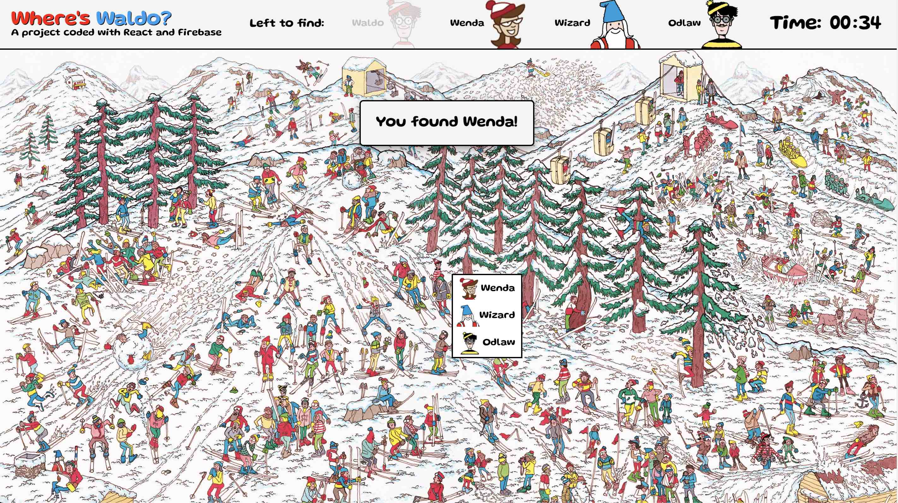
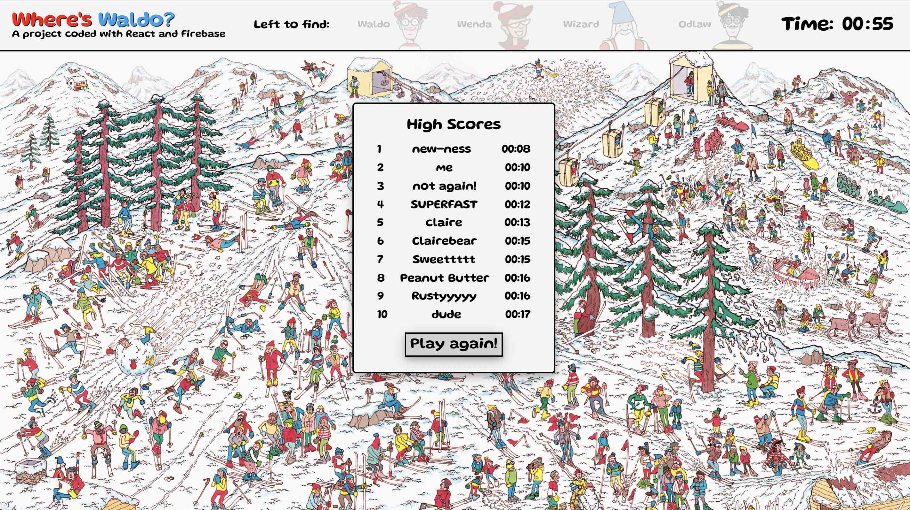

# 🔎 Where's Waldo?

&nbsp;&nbsp;
&nbsp;

Date completed:  December 4, 2021  

**Optimized for 🖥 desktop and 📱 landscape mobile!**  

**See it live at (https://rusty-reebs.github.io/wheres-waldo)!**  

Objectives: build a photo tagging app utilizing React on the front end and a Firebase cloud database on the back end.  

### Screenshots
-----

&nbsp;&nbsp;&nbsp;

### TIL Things I Learned
-----

- this was a great project that involved many practical programming skills like conditionals, asynchronous functions, and manipulating arrays.
- practiced using the array `.map` and `.filter` methods in React components.
- gained a stronger understanding of React hooks like `useEffect`. 
- how to set up and use a BaaS (Backend-as-a-Service) site, eg. Firebase.
- yet more practice with plain CSS!